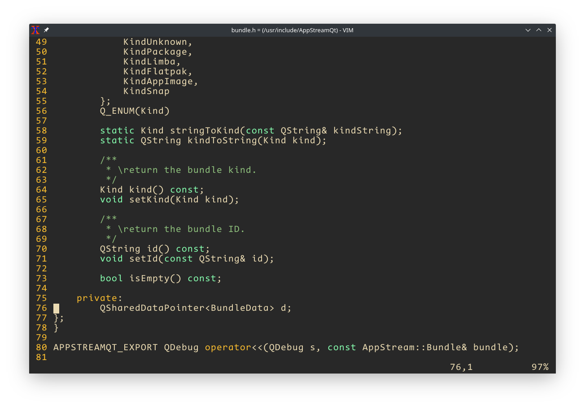

# Xresources

In 2021 Xterm still a good choice for your `terminal life` , My Xresources configure



### Clone project
```shell
$ cd ~
$ git clone https://github.com/ihexon/Xresources 
```

### Install Fonts
```shell
$ mkdir -p  ~/.local/share/fonts
$ cp ~/Xresources/fonts/*  ~/.local/share/fonts
```

### Load the Xresources
```shell
$ cp  ~/Xresources/Xresources ~/.Xresources
$ xrdb -load ~/.Xresources
```
